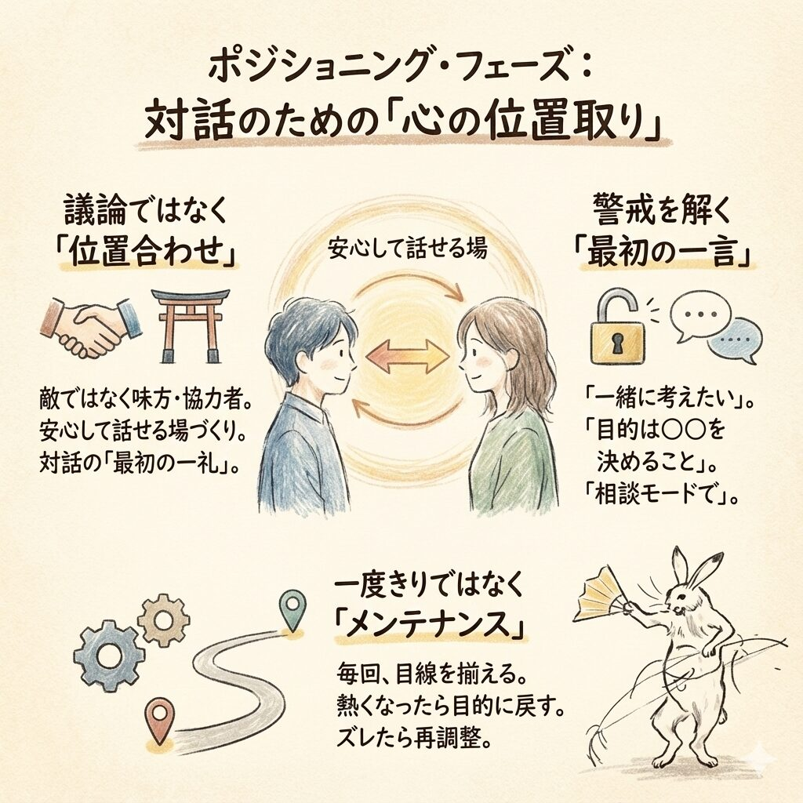

{ width="500" }

## ポジショニング・フェーズ

たとえばチームメンバーとの個別面談、あるいはチームでの打合せで。一生懸命、いいことを話している。資料も整っている。なのに、相手がどこか固い。うなずいてはいるのに、合意に届かない。不思議だと思いませんか？

実はこれ、「話のなかみ」以前の問題なんです。いきなり話を進めてしまって、相手の心が「え、何が始まるの？」と身構えてしまう。会社の会議で、親子の会話で、これを何度見たかわかりません。

ここで効いてくるのが、RMSの第一歩、「ポジショニング」フェーズです。言ってみれば、味方・仲間として立ち位置と目的をそろえる「心の位置取り」。話術でもロジックでもなく、最初に「土俵」や「目線」を合わせる作法なんですね。

## 1. ポジショニングは「議論」ではなく「位置合わせ」

ポジショニングの本質はシンプルです。相手に「この人は敵じゃない。味方・協力者として、一緒に前に進もうとしている」と感じてもらうこと。安心して口を開ける「場・雰囲気」をととのえることです。

ここで必要なスキルは、派手さはないけど力強くて人を勇気づけるものです。

* 相手の前提（背景・状況）を読み解く力：  
  同じ言葉を使っていても、見ている世界が違うことがあります。相手の“前提”を読めないと、こちらの言葉は空振りします。
* 目的と立場を揃える作法  
  「何を決める時間か」「誰のための時間か」を揃えないまま本題に入ると、相手は防御姿勢になることがあります。
* 安心して口を開ける「場・雰囲気」をととのえること  
  これは会議の設計でもあり、声のトーンでもあり、「まず相手の安全を確保する」という姿勢でもあります。

あえて人類学っぽく言えば、これは「対話の礼法」なんです。昔から儀式には意味があるでしょう？ いきなり本殿にズカズカ入らない。まず一礼して、境界を越える。ポジショニングは、現代の対話における“最初の一礼”みたいなものなんですね。

## 2. なぜ最初の一歩でつまずくのか：現場のリアル

会社でも家庭でも、現場ってみんな忙しい。だからつい「前置きはいいから本題へ」と急ぎたくなる。ところが、今までと少しでも違う話は相手にとって“めんどうな話”です。組織も人も、変化が苦手です。そこへ目的も立場も告げずに切り込むと、相手はこう思います。

* 「評価されるのか？」
* 「責められるのか？」
* 「何を言っても不利になるのでは？」

この瞬間、対話は“共同作業”じゃなくて“攻防戦”になります。つまり、ポジショニングで手を抜くと、あとからどれだけ丁寧に説明してもなかなか理解を得られないなど、修正コストが跳ね上がるんです。

だからポジショニングは、気合いでも根性でもなく「よき習慣」なんですね。

## 3. 具体的なテクニック：ラポール形成とスタイル診断は「下ごしらえ」

「心の位置取り」「目線あわせ」などと言うと抽象的に聞こえますが、テクニックがあります。

* [コミュニケーションスタイル診断]()  
  相手は「結論先出し派」か「背景重視派」か、「客観性重視」か「他の人の動向重視」か。これを見誤ると、話が正しく届きません。たとえば「ワシ・オウム・フクロウ・ハト」に分類する方法があります。
* [ラポール形成]()  
  相手の呼吸・速度・言葉の温度に合わせて、「この人は自分の側にいる」を身体感覚で作る。雑に言うと、“同じチームの空気”を先に作るんです。

ここは誤解しないでほしいのですが、これは媚びでも迎合でもありません。目的達成のための“交通整理”です。道路標識を立てるのと同じです。

!!! info "テクニックの章をお読みください"
    各テクニックは別章で詳しく書いています。ぜひお読みください。

## 4. 実践：フレーズの力は「相手の警戒を解除する」

では、実際に何を言うのか。ここがポイントです。ポジショニングは、長い説明ではなく“最初の一言”で決まることが多い。

* 1on1: 「スムーズに成果を出せるよう、今日は一緒に考えたいんだ」  
  この一言で、「評価面談」でなく「共同作業」と伝えられる。相手の心が前に向きます。
* 会議: 「今日の目的は〇〇を決めることです。進めてもよいでしょうか？」  
  目的と進行の主導権を、いったん参加者に渡す。これで“押し付け感”が減るんです。
* 家庭: 「怒るんじゃなくて、楽しく片付けられる方法を相談したいんだ」  
  叱責モードを切り、相談モードに切り替える宣言。家庭の対話でも、これが効きます。

これらのフレーズはときには魔法のように効きます。「あなたを敵にしない」「あなたの尊厳を守る」「一緒にやる」というメッセージが、内容より先に届くからです。

## 5. 陥りやすい穴：ポジショニングは“メンテナンス”である

ここで、ありがちな落とし穴があります。

**「一度行えば終わり」という誤解（繰り返しの重要性）**

同じテーマでも毎回“入口の一言”は必要です。相手は前回の話を忘れているかもしれませんし、今日は別件で頭がいっぱいかもしれません。だから毎回いったん「今日は何の時間か」を揃えるのがオススメです。

**「熱が上がるほどズレる」（途中で戻す）**

議論が熱くなったら、途中で何度でも「目的に戻す」必要があります。不思議なもので、熱が上がるほど人は“脱線”しがちです。そんなときこそ「そもそも今日は何を決めたいんだっけ？」と、現在地に戻してあげるんです。

ポジショニングは儀式というより、温度管理かもしれません。会話の途中で空気が変わったら、再調整する。これができると、どんなときもチームに一体感をもたらすことができます。

## 6. ポジショニング・フェーズのチェックリスト

ポジショニング・フェーズがうまく進められたか、下記のチェックリストで確かめてみましょう。

* 「メンバーや場の状態はととのったか？」: [ ✅ / ❌️ ]
    * メンバーが「今日の目的」を自分の言葉で言い直せる
    * トーンが防御から共同作業に切り替わる
    * 質問が出る

* 「次のフェーズに進めるか？」: [ ✅ / ❌️ ]
    * 「じゃあ事実から確認しようか」→ ディスカバリングへ

* 「割り込みを処理できたか」: [ ✅ / ❌️ ]（詳細は `concern-triage.md` に準ずる）
    * 割り込みをラベル付け（不安・誤解・別件）
    * 今扱うか後で扱うか決める
    * 目的に戻す一言を使う（例:「いったん目的に戻すね」）

## 7. まとめ：ポジショニングは「一度きりの挨拶」ではない

ポジショニングは、話し上手になる類のフェーズやスキルではありません。相手を味方・協力者として扱い、目的と立場を揃え、安心して口を開ける場をととのえる。これができると、同じ内容でも話の通りかたが変わります。

そして大事なのは、一度やって終わりじゃないこと。会話が揺れたら戻る。ズレたら直す。そうやって“目線の同期”を取り続けるんです。

この「心の位置取り」が整ったとき、次のディスカバリングに進めます。相手の前提を確かめ、真因を一緒に探し、打ち手の土台を作る。ここからが本番というわけなんです。
